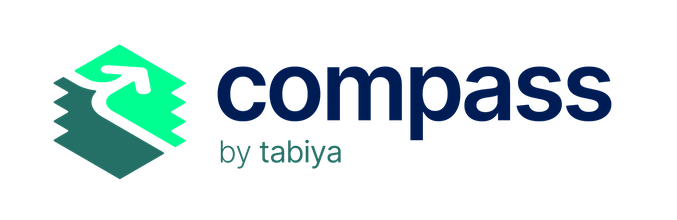

# Compass: Overview

<figure><picture><source srcset=".gitbook/assets/compass_logo_web_light.png" media="(prefers-color-scheme: dark)"></picture><figcaption></figcaption></figure>

Compass is Tabiya's open-source, generative AI-powered conversational agent, which talks to a young person, understands their past experience and skills, and matches them with the best opportunities for them. Compass focuses on skills over credentials, including skills from informal and unpaid work.

### Features

<table data-view="cards"><thead><tr><th></th><th></th><th></th></tr></thead><tbody><tr><td><strong>Open-source and Interoperable</strong></td><td></td><td></td></tr><tr><td><strong>Skills over Credentials</strong></td><td></td><td></td></tr><tr><td><strong>Responsible, Safe, and Transparent</strong> </td><td></td><td></td></tr><tr><td><strong>Voice-Based Interactions</strong> (coming soon)</td><td></td><td></td></tr><tr><td><strong>Multiple Local Languages</strong> (coming soon) </td><td></td><td></td></tr></tbody></table>

## The Challenge

Compass addresses two specific challenges:

1. Creating an effective CV that highlights relevant skills for employers is challenging. An inaccurate initial representation of someone's experiences can lead to incorrect guidance and negative impacts on their job prospects.
2. Current methods to assist jobseekers with this mostly rely on human counselors and are thus expensive and not scalable.

Compass uses a large language model (LLM) and a conversational interface to act as a digital counselor that helps job seekers build a CV that highlights their skills. The tool uses retrieval augmented generation (RAG) to combine an off-the-shelf commercial LLM with a structured and human-vetted overview of all occupations and skills in the labor market (a “skills taxonomy”). At the end of the conversation, jobseekers can download and store a skills report and CV.&#x20;

## Funders and Partners

<figure><figcaption></figcaption></figure>

